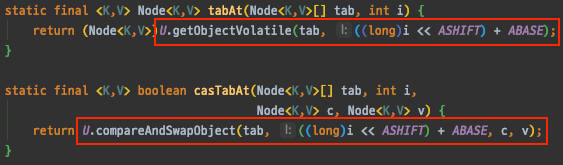

# ConcurrentHashMap

## ConcurrentHashMap



Hashtable 클래스의 단점을 보완하면서 Multi-Thread 환경에서 사용할 수 있도록 나온 클래스가 바로 ConcurrentHashMap입니다. (JDK 1.5에 검색과 업데이트 시 동시성 성능을 높이기 위해서 나온 클래스입니다.)

Hashtable, HashMap, ConcurrentHashMap 클래스 모두 Map의 기능적으로만 보면 큰 차이는 없습니다.

그러면 어떤 동기화 방식을 사용하고 어떤 특징이 있길래 Hashtable의 대안 클래스가 될 수 있을까요?

```java
public class ConcurrentHashMap<K,V> extends AbstractMap<K,V>
    implements ConcurrentMap<K,V>, Serializable {

    public V get(Object key) {}

    public boolean containsKey(Object key) { }

    public V put(K key, V value) {
        return putVal(key, value, false);
    }

    final V putVal(K key, V value, boolean onlyIfAbsent) {
        if (key == null || value == null) throw new NullPointerException();
        int hash = spread(key.hashCode());
        int binCount = 0;
        for (Node<K,V>[] tab = table;;) {
            Node<K,V> f; int n, i, fh;
            if (tab == null || (n = tab.length) == 0)
                tab = initTable();
            else if ((f = tabAt(tab, i = (n - 1) & hash)) == null) {
                if (casTabAt(tab, i, null,
                             new Node<K,V>(hash, key, value, null)))
                    break;                   // no lock when adding to empty bin
            }
            else if ((fh = f.hash) == MOVED)
                tab = helpTransfer(tab, f);
            else {
                V oldVal = null;
                synchronized (f) {
                    if (tabAt(tab, i) == f) {
                        if (fh >= 0) {
                            binCount = 1;
                            for (Node<K,V> e = f;; ++binCount) {
                                K ek;
                                if (e.hash == hash &&
                                    ((ek = e.key) == key ||
                                     (ek != null && key.equals(ek)))) {
                                    oldVal = e.val;
                                    if (!onlyIfAbsent)
                                        e.val = value;
                                    break;
                                }
                                Node<K,V> pred = e;
                                if ((e = e.next) == null) {
                                    pred.next = new Node<K,V>(hash, key,
                                                              value, null);
                                    break;
                                }
                            }
                        }
                        else if (f instanceof TreeBin) {
                            Node<K,V> p;
                            binCount = 2;
                            if ((p = ((TreeBin<K,V>)f).putTreeVal(hash, key,
                                                           value)) != null) {
                                oldVal = p.val;
                                if (!onlyIfAbsent)
                                    p.val = value;
                            }
                        }
                    }
                }
                if (binCount != 0) {
                    if (binCount >= TREEIFY_THRESHOLD)
                        treeifyBin(tab, i);
                    if (oldVal != null)
                        return oldVal;
                    break;
                }
            }
        }
        addCount(1L, binCount);
        return null;
    }
}
```

위의 코드는 ConcurrentHashMap 클래스의 일부 API 입니다. ConcurrentHashMap에는 Hashtable과는 다르게 synchronized 키워드가 메소드 전체에 붙어있지 않습니다. get() 메소드는 아예 synchronized가 존재하지 않고, put() 메소드에는 중간에 synchronized 키워드가 존재하는 것을 볼 수 있습니다.

이것을 좀 더 정리해보면 ConcurrentHashMap은 **읽기 작업에는 여러 쓰레드가 동시에 읽을 수 있지만, 쓰기 작업에는 특정 세그먼트 or 버킷에 대한 Lock을 사용한다**는 것입니다.

```java
public class ConcurrentHashMap<K,V> extends AbstractMap<K,V>
    implements ConcurrentMap<K,V>, Serializable {

    private static final int DEFAULT_CAPACITY = 16;

    // 동시에 업데이트를 수행하는 쓰레드 수
    private static final int DEFAULT_CONCURRENCY_LEVEL = 16;
}
```

ConcurrentHashMap 클래스를 보면 위와 같이 DEFAULT\_CAPACITY, DEFAULT\_CONCURRENCY\_LEVEL가 16으로 설정되어 있습니다.

DEFAULT\_CAPACITY는 HashMap에서 보았듯이 버킷의 수입니다. 그리고 DEFAULT\_CONCURRENCY\_LEVEL는 동시에 작업 가능한 쓰레드 수입니다.

`버킷의 수 == 동시작업 가능한 쓰레드 수`인 이유는 ConcurrentHashMap은 버킷 단위로 Lock을 사용하기 때문에 같은 버킷만 아니라면 Lock을 기다릴 필요가 없다는 특징이 있습니다. (버킷당 하나의 Lock을 가지고 있다라고 생각하면 될 것 같습니다.)

즉, 여러 쓰레드에서 ConcurrentHashMap 객체에 동시에 데이터를 삽입, 참조하더라도 그 **데이터가 다른 세그먼트에 위치하면 서로 락을 얻기 위해 경쟁하지 않습니다.**


## ConcurrentHashMap은 어떻게 동기화를 하는 것일까요?

putVal()  메소드를 조금 더 상세히 알아보겠습니다.

#### 1. 빈 해시 버킷에 노드를 삽입하는 경우

* Lock을 사용하지 않고 [Compare and Swap](https://jenkov.com/tutorials/java-concurrency/compare-and-swap.html)을 이용하여 새로운 노드를 해시 버킷에 삽입합니다. (원자성 보장)
* (Java에는 synchronized 말고도 다른 동기화 방식이 있는데 그 중에 하나를 사용한 것입니다.)


[compare-and-swap.md](compare-and-swap.md)


<figure><figcaption></figcaption></figure>

(1) 무한 루프. table은 내부적으로 관리하는 가변 배열입니다.

(2) 새로운 노드를 삽입하기 위해, 해당 버킷 값을 가져와(tabAt 함수) 비어 있는지 확인합니다.(== null)&#x20;

(3) 다시 Node를 담고 있는 [volatile](https://nesoy.github.io/articles/2018-06/Java-volatile) 변수에 접근하여 Node와 기대값(null)을 비교하여(casTabAt 함수) 같으면 새로운 Node를 생성해 넣고, 아니면 (1)번으로 돌아갑니다.(재시도)


<figure><figcaption></figcaption></figure>

[volatile](https://nesoy.github.io/articles/2018-06/Java-volatile) 변수에 2번 접근하는 동안 원자성(atomic)을 보장하기 위해 기대되는 값과 비교(Compare)하여 맞는 경우에 새로운 노드를 넣습니다(Swap).\
CAS 구현은 `java.util.concurrent.atomic` 패키지의 `Atomic*` 클래스들과 동일하게 내부적으로 `sun.misc.Unsafe`을 사용하고 있습다. (Unsafe 는 jdk11 부터 없어졌다고 합니다.)


#### 2. 이미 노드가 존재하는 경우

* `synchronized(노드가 존재하는 해시 버킷 객체)`를 이용해 하나의 스레드만 접근할 수 있도록 제어합니다.
* **서로 다른 스레드가 같은 해시 버킷에 접근할 때만 해당 블록이 잠기게 됩니다.**

<figure><figcaption></figcaption></figure>

synchronized 안의 로직은 HashMap 과 비슷한 로직입니다. 동일한 Key이면 Node 를 새로운 노드로 바꾸고, 해시 충돌(hash collision)인 경우에는 Separate Chaining에 추가하거나 TreeNode에 추가합니다. `TREEIFY_THRESHOLD` 값에 따라 체이닝을 트리로 바꿉니다.


## &#x20;ConcurrentHashMap 생성자

```java
public ConcurrentHashMap(int initialCapacity, float loadFactor, int concurrencyLevel) {
    if (!(loadFactor > 0.0f) || initialCapacity < 0 || concurrencyLevel <= 0)
        throw new IllegalArgumentException();
    if (initialCapacity < concurrencyLevel) // Use at least as many bins
        initialCapacity = concurrencyLevel; // as estimated threads
    long size = (long)(1.0 + (long)initialCapacity / loadFactor);
    int cap = (size >= (long)MAXIMUM_CAPACITY) ? MAXIMUM_CAPACITY : tableSizeFor((int)size);
    this.sizeCtl = cap;
}
```

생성자 중 위와 같은 생성자가 있습니다. 위에서 보았듯이 `conrrencyLevel`이 존재합니다. DEFAULT는 16이지만 이렇게 직접 지정할 수도 있습니다.(동시에 몇 개의 쓰레드를 작동하게 할 것인가를 결정합니다.)

ConcurrentHashMap은 **다른 버킷이라면 동시에 쓸 수 있다**고 했습니다. 그래서 데이터의 각 영역이 서로 영향을 주지 않는 작업에 대해서는 경쟁이 발생하지 않기 때문에 **여러 쓰레드에서 빈번하게 접근하더라도 락 획득을 위한 대기 시간을 많이 줄일 수 있습니다**.

효과를 극대화하기 위해서는 상황에 따라 적절히 세그먼트를 나누는 것이 필요합니다. 데이터를 **너무 적은 수의 조각으로 나누면 경쟁을 줄이는 효과가 적을 것**이고 **너무 많은 수의 조각으로 나누면 이 세그먼트를 관리하는 비용이 커집**니다.


## ConcurrentHashMap 언제 사용해야 할까요?

읽기 작업보다는 쓰기 작업에 성능이 중요한 상황에서 쓰면 적합한 것 같습니다.(같은 버킷만 아니라면 여러 쓰레드가 동시에 쓰는 작업을 할 수 있기 때문에)


## 유의사항

### 읽기 작업에는 동기화가 적용이 안 되는데 어떻게 진행될까요?

검색(get())에는 동기화가 적용되지 않으므로 업데이트 작업(put() or remove())과 겹칠 수 있습니다. 그래서 검색은 가장 최근에 완료된 업데이트 작업의 결과가 반영됩니다.



12:53 결함 2. 비좁은 통로


## 가변 배열 리사이징

HashMap에서 버킷 안에 노드가 로드팩터 값에 도달하게 되면 단순히 resize() 메소드를 통해 새로운 배열을 만들어 copy하는 방식을 사용합니다.\
하지만 ConcurrentHashMap 에서는 기존 테이블을 새로운 테이블로 버킷을 하나씩 전송(transfer) 하는 방식을 사용합니다. 이 과정에서 다른 쓰레드가 버킷 전송을 같이 할 수도 있습니다. Transfer가 모두 끝나면 크기가 2배인 새로운 테이블이 됩니다.


## 참고자료




